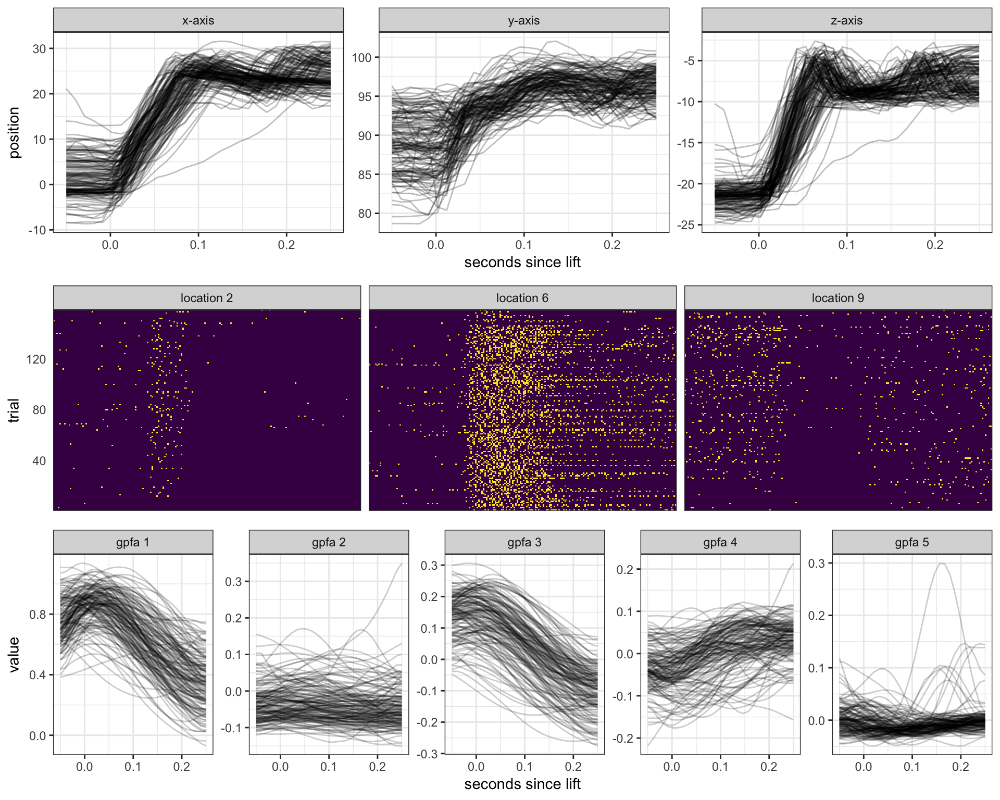
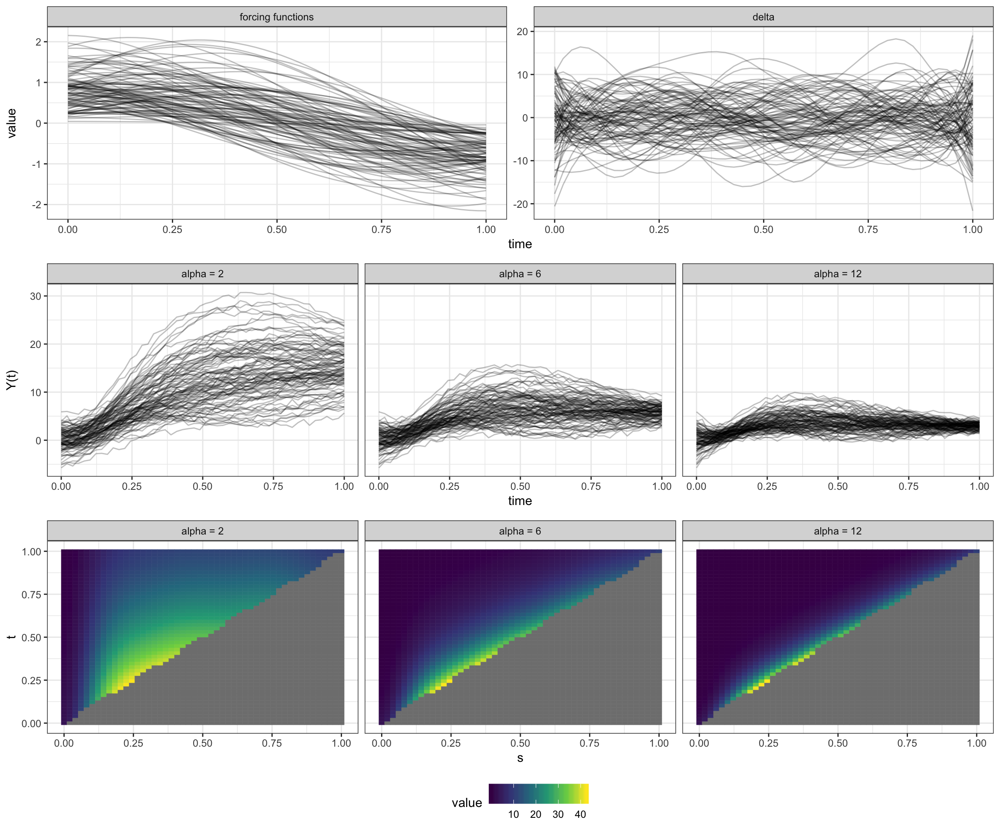
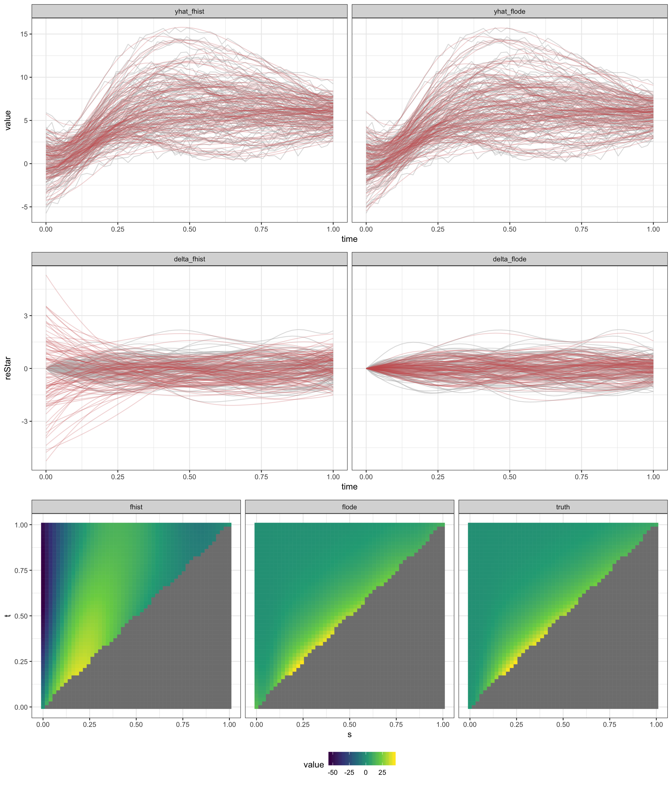
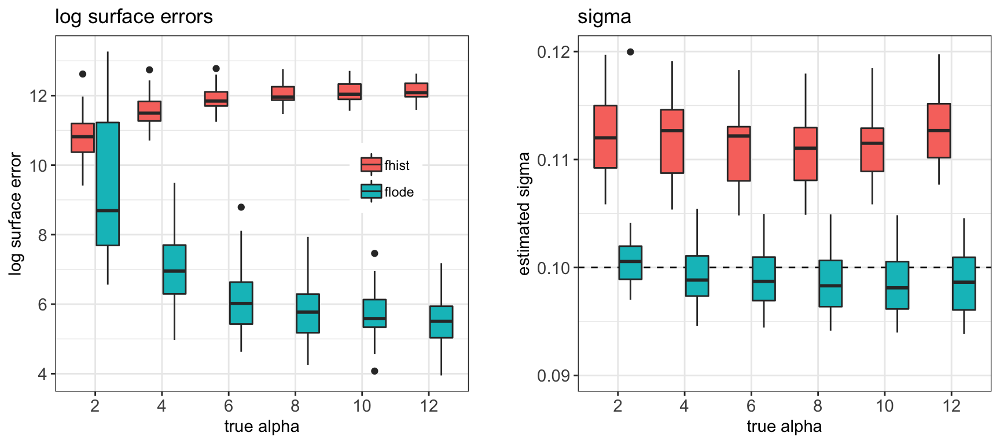
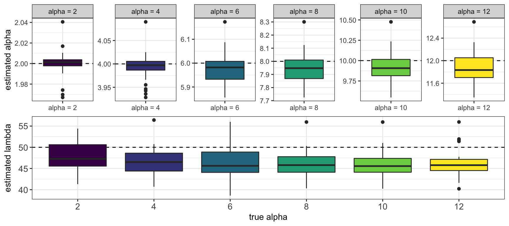
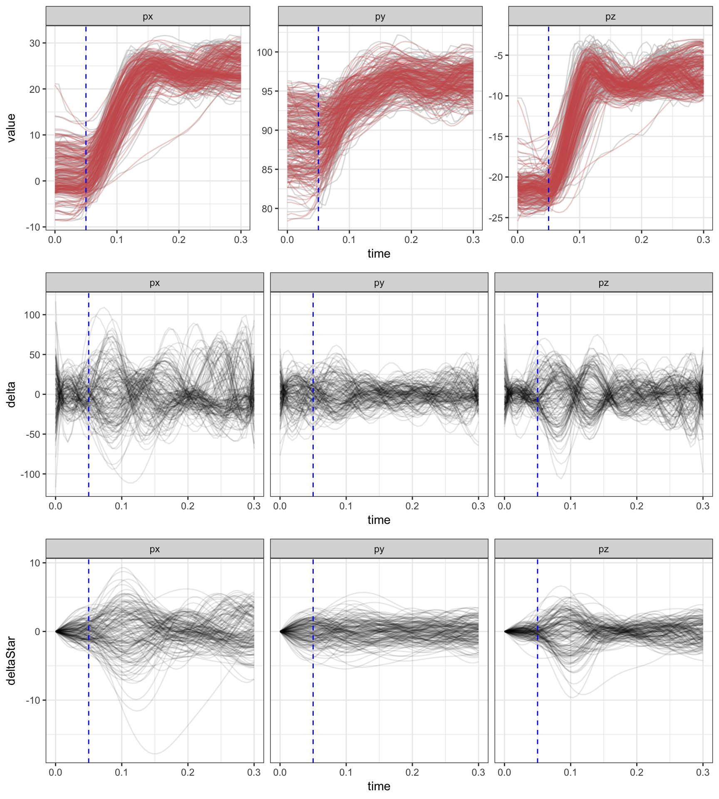
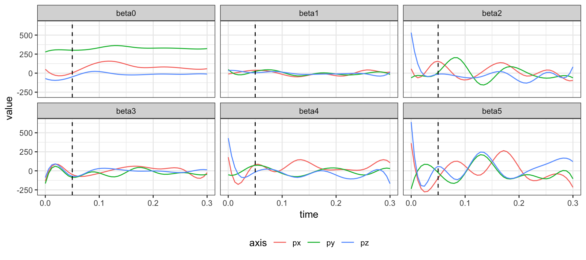
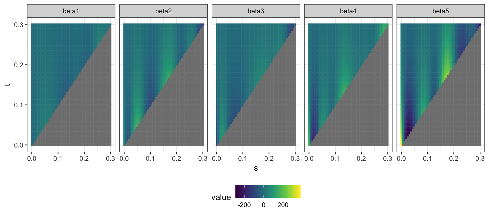

```{r setup, include=FALSE}
# Use fig.process to rename figure files generated by R so that they comply with
# the journal naming policies. Remember to name plot chunks with the format
# "Figure1", "Figure2", etc... You will find the figure files in
# `[...]_files/figure-latex/`.

knitr::opts_chunk$set(
  echo = TRUE,
  out.width="\\reprintcolumnwidth",
  fig.process = function(x) {
    x2 = sub('-\\d+([.][a-z]+)$', '\\1', x)
    if (file.rename(x, x2)) x2 else x
  }
)

# The JASA LaTeX class depends on the LaTeX package "revtex4-1". If you are
# using a full LaTeX distro, you should make sure "revtex4-1" is installed, and
# install it if not. If you are using TinyTeX, the following code will take care
# of installing the package for you.

if (tinytex::is_tinytex() && !tinytex::check_installed('revtex4-1')) {
  tinytex::tlmgr_install("revtex4-1")
}
```

# Introduction
\label{sec:intro}

Our motivating data comes from a study that collected 3D trajectories of paw position over time as a mouse made a trained reaching motion for a food pellet; the paw reach trajectories were measured concurrently with neural activity in the motor cortex, an area of the brain known to be important for voluntary movement. These data were collected in an effort to understand the relationship between neural activity and paw movement. This is an example from the increasingly common class of problems where outcome and responses are measured densely in parallel. For these data streams, we want to understand the relationship between inputs and outputs that are both functions measured on the same domain.
Recent work using these data suggests that the dynamics of the arm during dexterous, voluntary movements are tightly coupled to neural control signals from the motor cortex \citep{guo2015, sauerbrei2018}. 

To better quantify how brain activity affects current and future paw position, we need a method that  (1) allows future position to depend on past but not future neural firing rate, (2) allows future position to be affected by initial position, (3) has parameters that model the relationship between the paw trajectory and the brain as a dynamical system of inputs and outputs, the state of which evolves over time, and (4) can accommodate repeated functional observations across trials. These problems cannot be simultaneously addressed by current methods. We develop a novel regression framework that combines ordinary differential equations (ODEs) and functional regression and is well-suited to address the problems our data presents. This work is connected to both the ODE and functional data analysis literatures, which we review in Sections \ref{sec:odes} and \ref{sec:fda}, respectively. First, in Sections \ref{sec:data} and \ref{sec:flode}, we describe our motivating data and model structure in more detail.

## Paw trajectory data
\label{sec:data}

The motivating data were collected as part of a study on the specific role of the motor cortex in enacting skilled movement, where a skilled movement is defined as a voluntary behavior that requires coordination and precision. Several experiments from \cite{guo2015} and \cite{sauerbrei2018} show that the motor cortex generates a continuous signal driving reach-to-grasp movements in mice.

In the experimental framework that generated our motivating data, a single mouse was trained to reach for a food pellet in a memorized location after hearing an auditory cue. The mouse was fixed at the head to reduce variability in posture, the auditory cue was played, and the mouse enacted the task of picking up its paw from a resting location to reach for and grasp the food pellet. Video recordings of the task completion were used to extract 3D trajectories of paw position from lift (the point at which the paw leaves its rest position) to grasp (the point at which the paw grasps the food pellet). An electrode array was inserted into motor cortex to simultaneously record the spike times of 25 neurons. This describes a single trial of the experiment, which was repeated 147 times. 

For each trial $i$, paw position was recorded in the $x$, $y$, and $z$ directions over 4 seconds, resulting in trivariate functional observations $\{ Y_i^{P_x}(t), Y_i^{P_y}(t), Y_i^{P_z}(t)\}$. Because we treat each direction independently, going forward we simplify notation to $Y_i(t)$ by omitting the superscripts $P_x$, $P_y$, and $P_z$. The auditory cue was played 0.5 seconds into the trial, on average lift occurred at 0.77 seconds, and on average grasp occurred at 0.88 seconds into the trial. For our analysis we limit the time frame to the period 0.05 seconds before lift to 0.25 seconds after lift for each trial, and data is linearly shifted so that the timing of lift for each trial is aligned. 

```{r flode_data, echo=FALSE, fig.width=12, fig.cap="Top row: Paw trajectories along $x$, $y$, and $z$ axes for 147 trials. Middle row: neural firing rates for 3 of the 25 neurons. Each row is a trial and each column is a point in time, and dark or light shading indicates that a neuron is off or on, respectively, at that point in time. After auditory cue, neurons show light activation at location 2, high activation at location 6, and dampening in activation at location 9. Bottom row: The five factors from Gaussian process factor analysis, shown for all 147 trials."}

```


The top row of Figure (\ref{fig:flode_data}) shows the paw positions across trials and axes, from 0.05 seconds before lift to 0.25 seconds after lift. Across axes, paw position at time $t$ depends on initial paw position at the start of the trial. The middle row of Figure (\ref{fig:flode_data}) shows heat maps of the first 2 seconds of neural activity for 3 of the 25 neurons, which were chosen because they are representative of patterns seen across neurons. In figures showing neural spike times, each row is a trial and each column is a point in time; dark or light shading indicates that a neuron is off or on, respectively. After the auditory cue at 0.5 seconds, neurons at location 2 are mildly activated, neurons at location 6 are highly activated, and neurons at location 9 become less activated. Activity within neurons was fairly consistent across trials, but large differences are seen across neurons. 

Firing rates of the 25 neurons were reduced to five dimensions using Gaussian process factor analysis (GPFA), a standard technique for decomposing noisy neural spiking activity into smooth low-dimension neural trajectories \citep{yu2009}. From a neurobiological perspective, extracting emergent patterns in the motor cortex using GPFA is a better way of assessing how neural activity drives behavior than using the raw neural firing data, because it increases generalizability across neurons and trials. From a statistical perspective, GPFA also reduces risk of collinearity when using the neural firing rates as covariates in a regression setting. 

Previous work used initial position and neural activity data to predict paw trajectories for held-out trials. However, this work did not allow for the relationship between position and neural activity to vary over time, and did not enhance interpretation of this system of inputs and outputs. We describe our model below; this work introduces a novel regression method that is well-suited to our scientific context.

## flode model
\label{sec:flode}

The biological underpinnings of our data are a dynamical system where initial position and paw are being acted on by outside forces coming from the motor cortex; these forces drive changes in velocity of the paw which then influences position. We introduce the *flode* (**f**unctional **l**inear **o**rdinary **d**ifferential **e**quation) model, a novel functional regression framework that represents this neurobiological system of inputs (motor cortical activity) and outputs (paw position). The *flode* model is a first-order ordinary differential equation (ODE), which allows us to incorporate how change in paw position influences position at time $t$, reflecting the dynamic nature of our data. In its differential form, our model is

\begin{equation}
\label{eq:flode_deriv}
y'_i(t) = -\alpha y_i(t) + \delta_i(t) + \mathcal{B}_0(t) + \sum_{p = 1}^P \mathcal{B}_p(t) x_{ip}(t),
\end{equation}

\noindent
where  $y_i(t)$ and $y'_i(t)$ are the paw position and first derivative of paw position (velocity) at time $t$, $x_{ip}(t), p \in 1\ldots P$ are trial-specific forcing functions, and $\alpha$, $\delta_i(t)$, and $\mathcal{B}_p(t), p\in 0\ldots P$ are parameters to be estimated from the data. Forcing functions, analogous to covariates in a traditional regression model, are external input forces that act on the ODE system.

This is a buffered system, meaning the response time is longer than the time interval in which the input changes. The scalar parameter $\alpha$, called the buffering parameter, indicates the amount of buffering on the system. As $\alpha \to 0$, buffering increases, and the effects of forcing functions and initial position persist in time. As $\alpha$ grows larger, the effects of forcing functions and initial position becomes instantaneous. The $\mathcal{B}_p(t)$ are coefficient functions that measure the impact of changes in the forcing function $x_{ip}(t)$ on the system, interpreted as the change in paw velocity at time $t$, $y'_i(t)$, given a one unit change in forcing function $x_{ip}(t)$. $\mathcal{B}_0(t)$ and $\delta_i(t)$ are the population-level and trial-specific intercepts, respectively. The $\delta_i(t)$ terms capture residual within-trial correlation; while much of fine motor control is known to be driven by the motor cortex, other brain regions also contribute to the paw reaching motion, and the $\delta_i(t)$ term is intended to capture changes in position driven by unmeasured influences. 

Many systems of differential equations cannot be solved analytically, which makes traditional statistical estimation techniques with the observed data $Y$ as the outcome challenging. However, the class of ODEs we consider has a solution, which we parameterize in terms of the initial value, given by
	
\begin{equation}
\label{eq:flode_mod}	
	Y_i(t) = y_i(0)e^{-\alpha t} + \int_0^t e^{-\alpha (t-s)}\delta_i(s)ds + \sum_{p=0}^P\int_0^t e^{-\alpha (t-s)} \mathcal{B}_p(s)x_{ip}(s)ds + \epsilon_i(t).
\end{equation}

\noindent
We make a distinction between $y_i(t)$, the true (unobserved) paw position at time $t$, and $Y_i(t)$, the paw position at time $t$ observed with measurement error $\epsilon_i(t)$. Thus, in model (\ref{eq:flode_mod}) above, we assume the outcome $Y_i(t)$ is measured with error but depends on the true initial position $y_i(0)$. 

The *flode* model is a first-order linear differential equation, which reflects the biological process that is hypothesized to generate the observed data. To familiarize readers with ordinary differential equations and their use in statistics, we review the ODE literature in Section \ref{sec:odes}. An overview of the functional data analysis literature dedicated to regression, provided in Section \ref{sec:fda}, is also pertinent since the paw trajectories will be conceptualized and modeled as i.i.d. realizations of functions that are observed over time.

## ODEs
\label{sec:odes}

Systems of ordinary differential equations (ODEs) can be used to directly model the relationship between an outcome and its derivatives, leading to widespread popularity for modeling dynamical systems in physics, biology, neuroscience, and other disciplines. First-order ODEs, which incorporate only the first derivative of $y$, follow the form given in Equation (\ref{eq:flode_deriv}), though the $\delta_i(t)$ term we include is unconventional.

Equation (\ref{eq:flode_deriv}) is also said to be a linear differential equation because its right hand side can be written as a linear combination of $y$ and terms that do not contain $y$  \citep{tennenbaum1985}. Though more complex ODEs are possible, such as those of higher order or with nonlinearity, we believe the simpler model can capture the dynamics of our data. When analytically solvable, most ODEs do not have a unique solution. It is therefore common, and useful for our data setting, to solve in terms of the initial value $y(0)$.

Most applications of ODEs in science and engineering focus on restrictive rather than general settings, in part because parameter estimation for general models is challenging. In the past this specificity has limited their use in statistics, but they are growing in popularity. \cite{chen2017} reconstructs gene regulatory networks by estimating sparse nonlinear ODEs for noisy gene expression data, building on previous work \citep{lu2011, henderson2014}.  

In their instant classic Dynamic Data Analysis, \cite{ramsay2017} conceptualize dynamical systems as data-driven statistical models. The book provides a framework for estimating a large class of differential equations, as well as an excellent overview of ODE-based models that expands on earlier work from \cite{ramsay2007} for parameter estimation in nonlinear ODEs. Separate estimation frameworks are provided for linear and nonlinear ODEs though both involve a tradeoff between the best fit to a particular prespecified ODE and a smooth fit to the data, enforced using B-spline expansions. While this general framework is well-suited to estimate parameters for a single realization of an ODE, it does not accommodate multiple trials or the complexities that arise in that case.

## Functional regression models
\label{sec:fda}

Our data setting and proposed methods are also closely related to functional data analysis. In functional data analysis, curve $Y_i(t)$ is the fundamental unit of statistical analysis \citep{ramsay2005}, and functional analogs of univariate methods like regression, PCA, and others build on this framework. Functional regression models capture the relationship between outcome curves $Y_i(t), i \in 1 \ldots N$ from $N$ independent trials, and the covariate(s) $x_i$, which can be scalar or functional. In particular, function-on-function regression allows for both functional responses and functional predictors that can be observed on different domains, and the response is related to the predictor through integration of a coefficient surface \citep{ramsay2005}.

Some special cases of function-on-function regression include the linear functional concurrent model \citep{fan2008, goldsmith2017} and the historical functional regression model \citep{malfait2003}. The concurrent model uses the current value of the predictor to measure the response at each time, but doesn't allow the covariates to affect future values of the response. The historical functional model allows the response at time $t$ to be influenced only by the predictors up to time $t$; this is ideal for data where the response and predictor are measured on the same domain, and prevents future values of the predictors from influencing the present value of the response. Advances in functional regression and accompanying software allow for historical functional regression models with scalar and functional covariates, as well as functional trial-specific random effects \citep{scheipl2015, scheipl2016, refund}. The historical model with trial-specific random intercept $\gamma_i(t)$ is given by

\begin{equation}
\label{eq:fhist_mod}	
Y_i(t) = \gamma_i(t) + \beta_0(t) +  \sum_{p = 1}^P \int_{s = 0}^t \beta_p(t,s) x_{ip}(s)ds+ \epsilon_i(t).
\end{equation}

\noindent
Here $\beta_0(t)$ is the population-level intercept, and each $\beta_p(t,s)$ is a coefficient surface. This flexible model is designed to handle repeated functional observations, and inclusion of the random intercept $\gamma_i(t)$ accounts for within-trial residual correlation in the errors after modeling the relationship between the outcome and the covariates curves. 

Conceptually both the integrated *flode* model in \ref{eq:flode_mod} and historical functional regression use predictors, including their recent history, to understand current values of the response function. Because of these high-level similarities we find it useful to compare and contrast these methods. If we assume the surface $\beta(t,s)$ from Equation (\ref{eq:fhist_mod}) takes the form  $e^{-\alpha (t-s)} \mathcal{B}(s)$ from Equation (\ref{eq:flode_mod}), $\gamma_i(t) = y_i(0)e^{-\alpha t} + \int_0^t e^{-\alpha (t-s)}\delta_i(s)ds$, and $\beta_0(t) = \int_0^t e^{-\alpha (t-s)}\mathcal{B}_0(s)ds$, then *flode* can be considered a special case of the historical functional regression model. However, the *flode* surface $e^{-\alpha (t-s)} \mathcal{B}(s)$ is very restricted compared to the more general historical surface $\beta(s,t)$; as a result, the historical model is likely too flexible and may overfit data that is generated by the *flode* model.

These assumptions are not trivial. From a conceptual standpoint, *flode* introduces a new framework for thinking about the relationship between inputs and outputs in an ODE system, and the historical model does not offer this interpretation. Initial position is a crucial element of the *flode* framework because it provides a specific analytic solutions to the ODE in \ref{eq:flode_deriv}; in contrast initial position is not a natural element of  the historical model and does not have precedent in the functional regression literature. Explicitly incorporating initial position into a functional regression context is both critical for our dynamical systems approach and a novel contribution in its own right. Finally, the *flode* model is nonlinear in its parameter $\alpha$, a development which other functional regression methods haven't directly addressed.

# Methods
\label{sec:methods}

Our work introduces models (\ref{eq:flode_deriv}) and (\ref{eq:flode_mod}), a novel framework for modeling functional observations with an explicit dynamical systems interpretation.  


## Model formulation

The *flode* method is a system of differential equations, where equation (\ref{eq:flode_deriv}) represents the model on the scale of the paw velocity, and equation (\ref{eq:flode_mod}) on the scale of the paw position. Because we observe paw position data rather than paw velocities, we estimate parameters using the paw position model. However, we are interested in interpretation on the velocity scale.

In this section we explain our parameter estimation approach. The buffering parameter $\alpha$ will be estimated using nonlinear least squares. Since we observe initial position with error, $Y_i(0)$, we also need to estimate true initial position, $y_i(0)$. The random effects $\delta_i(t)$ and coefficient functions $\mathcal{B}_p(t)$ will be estimated using penalized splines. Under these conditions all parameters will be estimated jointly using the algorithm described in Section \ref{sec:em_algorithm}.

To induce smoothness and reduce dimensionality, the trial-specific random intercepts $\delta_i(t)$ and coefficient functions $\mathcal{B}_p(t)$ are expanded using a fixed B-spline basis, $\mathbf{\Theta}(t)$, of $K_t$ basis functions  $\theta_1(t),\ldots , \theta_{K_t}(t)$, such that $\delta_i(t) = \mathbf{\Theta}(t)\mathbf{d}_i$ and $\mathcal{B}_p(t) = \mathbf{\Theta}(t)\mathbf{b}_p$, where $\mathbf{d}_i$, $i \in 1\ldots N$ is a  $K_t \times 1$ vectors of spline coefficients for the random intercept of the $i$th trial, and $\mathbf{b}_p$, $p \in 0, \ldots, P$ is a $K_t \times 1$ vector of spline coefficients for the $p$th coefficient function. Using this representation each forcing function term becomes

\begin{eqnarray*}
\sum_{p=0}^P \int_{s=0}^t e^{-\alpha (t-s)} \cdot x_{ip}(\mathbf{s}) \cdot \mathcal{B}_p(s) ds &=&\sum_{p=0}^P \int_{s=0}^t e^{-\alpha (t-s)} \cdot x_{ip}(s) \cdot  \Theta(s)\mathbf{b}_p ds \\[5mm]
&=& \sum_p \left(\int_{s=0}^t \left[\{e^{-\alpha (t-s)}\cdot x_{ip}(s)\}\otimes 1^T_{K_t}\right] \cdot \Theta(s) ds\right)\mathbf{b}_p \\[5mm]
&=& \sum_px_{ip}^*(t, \alpha)\mathbf{b}_p\\
&=& \mathbf{x}_i^*(t, \alpha)\mathbf{b},
\end{eqnarray*}

\noindent
where $\otimes$ denotes the element-wise Kronecker product, and $1_{K_t}$ is a length $K_t$ column vector with each entry equal to 1. We define a $D \times \{K_t \times (P + 1)\}$ matrix $\mathbf{x}_i^*(t, \alpha) = \left\{x_{i0}^*(t, \alpha) | \ldots | x_{iP}^*(t, \alpha) \right\}$ and a $\{K_t \times (P + 1)\} \times 1$ vector $\mathbf{b} = \left(\mathbf{b}_0^T | \ldots | \mathbf{b}_P^T \right)^T.$ Similarly, the random intercept term becomes 

\begin{eqnarray*}
 \int_{s=0}^t e^{-\alpha (t-s)} \cdot \delta_i(s)ds &=&   \int_{s = 0}^t e^{-\alpha (t-s)} \cdot \Theta(s)\mathbf{d}_i ds\\[5mm]
&=&  \left[\int_{s = 0}^t \left\{ e^{-\alpha (t-s)}\otimes 1^T_{K_t} \right \}\cdot \Theta(s) ds\right] \mathbf{d}_i  \\[5mm]
&=& \mathcal{D}^*(t, \alpha)\mathbf{d}_i,
\end{eqnarray*}

\noindent
Finally, we define $y_{i0}^*(t, \alpha) = y_i(0)e^{-\alpha t}$. 

Though the conceptual model is expressed over continuous time domain $t$, in practice, each trajectory $Y_i$ is observed on the discrete grid, $\mathbf{t} = \{t_1, t_2, \ldots, t_D\}$, which we assume to be equally spaced and shared across trials. Functions $Y_i(\mathbf{t})$ evaluated on this grid are vectors of length $D$, and $\mathcal{D}^*(\mathbf{t}, \alpha)$ and $x_{ip}^*(\mathbf{t}, \alpha)$ are $D \times K_t$ matrices. Letting $\mathbf{\Theta}(\mathbf{t})$ be the $D \times K_t$ spline matrix evaluated at $\mathbf{t}$, then $\delta_i(\mathbf{t}) = \mathbf{\Theta}(\mathbf{t})\mathbf{d}_i$ and $\mathcal{B}_p(\mathbf{t}) = \mathbf{\Theta}(\mathbf{t})\mathbf{b}_p$. Putting these terms together and evaluating on grid $\mathbf{t}$ gives the observed data model,

\begin{equation}
\label{eq:observed_mod}	
	Y_i(\mathbf{t}) = y_{i0}^*(\mathbf{t}, \alpha) +  \mathcal{D}^*(\mathbf{t}, \alpha)\mathbf{d}_i +  \mathbf{x}_i^*(\mathbf{t}, \alpha)\mathbf{b} + \epsilon_i(\mathbf{t}).
\end{equation}

\noindent
We use the notation  $g^*(t, \alpha)$ above to highlight that terms $\mathbf{x}_i^*(t, \alpha)$,  $\mathcal{D}^*(t, \alpha)$, and $y_{i0}^*(t, \alpha)$ are all functions of both time $t$ and the model parameter $\alpha$. However, throughout this section these terms will be used interchangeably with the terms $\mathbf{x}_i^*$, $\mathcal{D}^*$, and $y_{i0}^*$ for notational simplicity. Naturally, on a discrete grid the integral defined above needs to be approximated numerically. For numeric integration we use a Riemannian approach, but other approaches would be reasonable as well.

We assume both the spline coefficients for the trial-specific intercept, $\mathbf{d}_i$, and the white noise, $\epsilon_i(t)$, are random and have the following distributions

$$\epsilon_i(t) \sim N(0, \sigma^2I_D)$$
$$\mathbf{d}_i \sim N(0, \Sigma_{Kt\times Kt}),$$

\noindent
which induces a conditionally normal distribution on the observed data given the random effects,

$$Y_i| \mathbf{d}_i \sim N\left(y_{i0}^* + \mathcal{D}^*\mathbf{d}_i+  \mathbf{x}_i^*\mathbf{b}, \sigma^2I_D \right).$$

\noindent
Penalization is a popular technique to avoid overfitting in functional models which we emply here for both random and fixed effect spline coefficients. For fixed effect spline coefficients $\mathbf{b}_p; p\in 0,\ldots,P$, we assume $\mathbf{b}_p \sim N(0, \lambda_{b,p}\mathcal{P}^{-1})$, which introduces a smooth penalty on the coefficient functions. Similarly, we assume the random intercept variance is $\Sigma_{Kt\times Kt} = \lambda_d\mathcal{P}^{-1}$. Here $\mathcal{P}^{-1}$ is a known penalty matrix that is shared across fixed and random effects to enforce a common penalty structure.


We estimate the buffering parameter $\alpha$, variance parameters $\sigma^2$ and $\lambda$, true initial positions $y_i(0)$, and spline coefficients $\mathbf{b}$ and $\mathbf{d}_i$ using the expectation-maximization algorithm described in below. The algorithm incorporates a nonlinear least squares step to optimize the $\alpha$ parameter.

## EM algorithm for estimating fixed and random effects
\label{sec:em_algorithm}

We use an expectation-maximization (EM) algorithm to find the maximum likelihood estimates (MLEs) of both fixed and random effects, following precedent from \cite{laird1982} for longitudinal data and \cite{walker1996} for nonlinear mixed models. Our goal is to estimate the experiment-wide fixed effects $\mathbf{\Phi} = \left\{\alpha, \mathbf{b}, y_i(0), \sigma^2, \lambda_d, \lambda_{b, 0}, \ldots, \lambda_{b, P}\right\}$ and the random effect spline coefficients $\mathbf{d}_i$. In the $M$-step of the algorithm we estimate the MLE of the fixed effects when the random effects are observed, $\widehat{\mathbf{\Phi}} = \underset{\mathbf{\Phi}}{\mathrm{argmax}}\{l(\mathbf{\Phi} | Y)\}$, and in the $E$-step we get estimates for the random effects by taking the expectation of the $\mathbf{d}_i$ under the posterior distribution of $\mathbf{d}_i$ given the data $Y_i$.

### M-step

When the random effects $\mathbf{d}_i$ are known, the MLE of $\mathbf{\Phi}$ maximizes the joint log-likelihood

\begin{eqnarray*}
l(\mathbf{\Phi})) &=& \log p(Y,  \mathbf{d} ; \mathbf{\Phi})\\
&=&  \log p(Y|  \mathbf{d} ; \mathbf{\Phi}) + \log p(\mathbf{d}; \mathbf{\Phi}) + \sum_{p = 0}^P\log p(\mathbf{b}_p; \mathbf{\Phi})\\
&=&  \log p\left\{Y|  \mathbf{d} ; \alpha, \mathbf{b}, y_i(0), \sigma^2\right\} + \log p(\mathbf{d} ; \lambda_d) + \sum_{p = 0}^P\log p(\mathbf{b}_p ; \lambda_{b, p}).
\end{eqnarray*} 

\noindent
This leads to the following fixed effects

\begin{eqnarray*}
\hat{\alpha} &=& \underset{\alpha}{\mathrm{argmin }}\epsilon^T\epsilon\\[5mm]
\widehat{\mathbf{b}} &=& \left\{\mathbf{x}^{*T}\mathbf{x}^* + \sigma^2\mathcal{P}_b \right\}^{-1}\mathbf{x}^{*T}\left(Y - y_{0}^* - \bm{\mathcal{D}}^*<\mathbf{d}> \right)\\[5mm]
\mathcal{P}_b &=& diag\left(\lambda_{b, 0}^{-1}\mathcal{P}, \lambda_{b, 1}^{-1}\mathcal{P}, \ldots,  \lambda_{b, P}^{-1}\mathcal{P} \right)\\[5mm]
\widehat{y}_i(0) &=& \frac{(e^{-\alpha\mathbf{t}} )^T \left\{Y_i -  \mathcal{D}^*<\mathbf{d}_i> - \mathbf{x}_i^*\mathbf{b} \right\}}{(e^{-2\alpha\mathbf{t}})^T 1_{D}}\\[5mm]
\widehat{\sigma}^2 &=& \frac{\epsilon^T\epsilon}{ND}\\[5mm]
\widehat{\lambda}_d &=& \frac{\sum_i <\mathbf{d}_i^T\mathcal{P}\mathbf{d}_i>}{NK_t}\\[5mm]
\widehat{\lambda}_{b, p} &=&\frac{ \mathbf{b}_p^T\mathcal{P}\mathbf{b}_p}{K_t}.
\end{eqnarray*} 

\noindent
The notation $tr(A)$ indicates the trace of matrix $A$, and $1_{D}$ is a length $D$ column vector with each entry equal to 1. When not indexed by $i$, the vectors $Y$ and $y_0^*$ denote length $ND$ stacked forms of their trial-specific length $D$ counterparts, $Y_i$ and $y_{i0}^*$. Similarly, $\mathbf{d}$ is a stacked length $NK_t$ vector, and $\mathbf{x}^*$ and $ \bm{\mathcal{D}}^*$ are stacked $ND \times K_t$ matrices. The residual sum of squares, $\epsilon^T\epsilon$, is given by

\begin{eqnarray*}
\epsilon^T\epsilon &=& (Y- y_{0}^* - \bm{\mathcal{D}}^*<\mathbf{d}> -  \mathbf{x}^*\mathbf{b})^T(Y - y_{0}^* - \bm{\mathcal{D}}^*<\mathbf{d}> -  \mathbf{x}^*\mathbf{b})\\
&=& Y^TY - 2Y^T\left(y_{0}^* + \bm{\mathcal{D}}^*<\mathbf{d}> + \mathbf{x}^*\mathbf{b}\right) + y_{0}^{*T}
y_{0}^* + 2 y_{0}^{*T}\left( \bm{\mathcal{D}}^*<\mathbf{d}> + \mathbf{x}^*\mathbf{b}  \right) \\
&+& \left( \mathbf{x}^*\mathbf{b}\right)^T\left( \mathbf{x}^*\mathbf{b}\right) + 2 \left( \mathbf{x}^*\mathbf{b}\right)^T \bm{\mathcal{D}}^*<\mathbf{d}> + <\mathbf{d}^T\bm{\mathcal{D}}^{*T}\bm{\mathcal{D}}^*\mathbf{d}>.
\end{eqnarray*} 

\noindent
The notation $<\ldots>$ represents the expected values of $\mathbf{d}$, $\mathbf{d}_i^T\mathcal{P}\mathbf{d}_i$, and $\mathbf{d}^T\mathcal{D}^{*T}\mathcal{D}^*\mathbf{d}$, the estimation of which are detailed in the E-step below.

### E-step

Bayes' rule leads to the posterior distribution of the random intercept coefficients, 

$$\mathbf{d}_i | Y_i \sim N\left(\mathbf{m}_i , \mathbf{C}\right),$$

\noindent
where

$$\mathbf{C} = \left\{\frac{1}{\lambda_d}\mathcal{P} + \frac{\mathcal{D}^{*T}\mathcal{D}^*}{\sigma^2}\right\}^{-1},$$
\noindent
and
$$\mathbf{m}_i = \frac{\mathbf{C} \mathcal{D}^{*T}\left(Y_i - y_{i0}^* -  \mathbf{x}_i^*\mathbf{b}\right)}{\sigma^2}.$$

\noindent
Then the solutions to $<\mathbf{d}_i>$, $<\mathbf{d}_i^T\mathcal{P}\mathbf{d}_i>$, and $<\mathbf{d}_i^T\mathcal{D}^{*T}\mathcal{D}^*\mathbf{d}_i>$ are $\mathbf{m}_i$, $tr(\mathcal{P}\mathbf{C}) + \mathbf{m}_i^T\mathcal{P}\mathbf{m}_i$, and $tr( \mathcal{D}^{*T}\mathcal{D}^*\mathbf{C}) + \mathbf{m}_i^T\mathcal{D}^{*T}\mathcal{D}^*\mathbf{m}_i$, respectively. We iterate between the $M$-step and the $E$-step to obtain a solution. The algorithm converges when the squared difference between the current estimate of $\widehat{\mathbf{\Phi}}$ and its value in the previous iteration become arbitrarily small.

The random intercept in the *flode* model is included to capture residual within-trial correlation in the paw trajectories. If one is willing to assume that the residuals are uncorrelated, then for each trial $\delta_i(t) = 0$ and the *flode* model simplifies, which allows parameters $\widehat{\mathbf{\Phi}}$ to be maximized directly without the $E$-step.

## Choice of penalty matrix and initial values

We choose a penalty matrix commonly used in functional data analysis \citep{eilers1996, goldsmith2016}. Here we also detail how we initialize variance parameters $\lambda$, as well as other parameters. For true initial position we initialize using observed initial position}.

## Implementation

Our methods are implemented in \texttt{R} and publicly available on \texttt{GitHub}. We use nonlinear least squares to estimate $\alpha$, which is implemented using the \texttt{optim} function, which uses a golden-section search algorithm to minimize the squared error loss in Equation \ref{eq:observed_mod}. Good initialization is important for fast convergence when using the \texttt{optim} function. For this reason, we recommend doing a grid search to find a value $\alpha_0$ that minimizes the loss function when $\delta_i(t) = 0$, and use this to initialize our full EM algorithm. Initial position $y_i(0)$ is initialized using the observed initial position $Y_i(0)$, and random effects $\delta_i(\mathbf{t})$ are initialized at 0.

# Simulations
\label{sec:simulations}

We assess the performance of our method using simulations designed to mimic the structure of our motivating data. Simulated data is generated from the *flode* model in Equation \ref{eq:flode_mod}, varying over the true value of the $\alpha$ parameter to obtain simulation settings that evaluate the sensitivity of our method as $\alpha$ changes.

```{r sim_data, echo=FALSE, fig.cap="This figure shows simulated data when alpha = 2, alpha = 6, and alpha = 12. Top row: Left column shows forcing functions, right column shows shows random effects on the paw velocity scale. Middle row: Observed paw positions for three different values of alpha. When alpha is small initial position has a larger effect on the overall trajectory.  Bottom row: Coefficient surfaces for three different values of alpha.  ADD EQUATIONS TO CAPTION."}



```

## Simulation design

Each simulated dataset has $N = 100$ univariate paw trajectories $Y_i(\mathbf{t}))$ with a population intercept $\mathcal{B}_0(t)$ and one forcing function $\mathbf{x}_1(t)$.  All trials share the same equally-spaced grid, $\mathbf{t}) \in [0, 1]$, of length $D = 50$. To reflect how initial values vary across trials in the motivating data, for each trial $i$, initial position $y_i(0)$ is sampled from $N(0, 5)$. The forcing function takes the form $\mathbf{x}_{i1}(\mathbf{t})) = scale_i \times \sin(\pi_i \mathbf{t}) + shift_i)$, where  $scale_i$ and $shift_i$ are randomly-drawn, trial-specific scale and shift parameters. Random intercepts $\delta_i(\mathbf{t}))$ are constructed using 10 B-spline basis functions  $\mathbf{\Theta}(\mathbf{t}))$ and spline coefficients $\mathbf{d}_i$, are drawn from  $\mathbf{d}_i \sim N(0, \lambda I_{10})$, where $\lambda = 50$. Measurement errors $\epsilon_i(\mathbf{t}))$ are drawn from  $\epsilon_i(\mathbf{t})) \sim N(0, \sigma^2 I_{D})$, where $\sigma^2 = 0.1$, an amount of residual variance which is comparable to that seen in our motivating data. 
 
 Figure \ref{fig:sim_data} shows three simulated datasets when $\alpha = 2$, $\alpha = 6$, and $\alpha = 12$. The middle and bottom rows show paw position trajectories $Y_i(t)$ and coefficient surfaces $e^{-\alpha (t-s)} \mathcal{B}_1(s)$, respectively, across $\alpha$ values. The top row shows (from left to right) forcing functions $x_{i1}(t)$ and random intercepts on the derivative scale $\delta_i(t)$, which do not depend on $\alpha$ and are shared across these three datasets. The middle panel highlights the buffering effect of $\alpha$. When $\alpha = 2$ buffering is high, meaning initial position has a consistent effect on the overall trajectory over the time span of the trial. When $\alpha = 12$ buffering is low, and the impact of initial position and forcing functions becomes instantaneous. 

We evaluate performance of our model as a function of the buffering parameter $\alpha$. For each $\alpha \in (2, 4, 6, 8, 10, 12)$, we simulate 25 different datasets, and apply the methods described in Section \ref{sec:methods} to each dataset. For model estimation we choose $K_t = 10$ B-spline basis functions. We initialize $\alpha$ using a rough grid search over $\alpha \in [1, 14]$ to find the value of $\alpha$ that minimize sum of squared error when $\delta_i(t) = 0$. The true initial position $y_i(0)$ is initialized using the observed initial position $Y_i(0)$, and random effects $\delta_i(\mathbf{t}))$ are initialized at 0.

## Comparison with historical functional regression

We compare *flode* to the historical functional regression model in (\ref{eq:fhist_mod}). This model is implemented using the \texttt{pffr} function from the \texttt{refund} package in \texttt{R} \citep{refund}, and is denoted *fhist* in text and figures below. Comparisons between *flode* and *fhist* are made based on recovery of the true coefficient surfaces. We define the surface from the *flode* model as $\beta_1^{flode}(s, t) = e^{-\alpha (t-s)} \mathcal{B}_1(s)$, and compare it to *fhist* surface $\beta_1^{fhist}(s, t)$. Surface recovery accuracy is quantified using the integrated squared error (ISE), where for *flode* $ISE = \int_t \int_s \left\{ \beta_1(s, t) - \widehat{\beta}_1^{flode}(s, t) \right\}^2 ds dt$ and for *fhist* $ISE = \int_t \int_s \left\{ \beta_1(s, t) - \widehat{\beta}_1^{fhist}(s, t) \right\}^2 ds dt$. We also compare *flode* and *fhist* based on recovery of the true measurement error, $\sigma^2 = 0.1$. 
 
The buffering parameter $\alpha$ is an important component of the *flode* model but is not estimated by the historical functional model. In figures below, in addition to comparing the performance of *flode* and *fhist*, we also visualize how well our *flode* implementation recovers the true value of $\alpha$ across simulation scenarios.

## Simulation results

Figure \ref{fig:sim_results} shows results from a single simulated dataset with $\alpha = 6$ and 100 trials. From top to bottom, rows show observed (gray) and fitted (red) values, true (gray) and estimated (red) random effects on the data scale, and coefficient surfaces. The top and middle rows show results for *fhist* (left column) and *flode* (right column), while the bottom row shows the *fhist*, *flode*, and true surfaces, respectively. For this simulated dataset, both *flode* and *fhist* produce reasonable results for the fitted values. However, it is clear from the random effects and coefficient surfaces that *flode* and *fhist* are estimating these overall fits in different ways, and that *flode* is recovering the true surface values. 

Figure \ref{fig:sim_surfaceErr} summarizes results for *flode* and *fhist* across datasets generated using different values of $\alpha$. The left panel shows $\log ISE$, and the right panel shows estimated measurement errors $\widehat{\sigma}^2_{flode}$ and $\widehat{\sigma}^2_{fhist}$. Across values of $\alpha$, *flode* outperforms *fhist* in terms of the $ISE$, which is consistent with observations in Figure \ref{fig:sim_results}. At low values of $\alpha$, the difference in performance between the methods is smaller, and $ISE$ variability for *flode* is high when $\alpha = 2$. Measurement error is slightly biased away from the true value $\sigma^2 = 0.1$ for both models, though the bias is larger for the *fhist* model across values of $\alpha$. The *flode* model is slightly overfitting the data, while *fhist* underfits the data. 

Figure \ref{fig:sim_alpha} shows estimated values $\widehat{\alpha}$ (top row) and random effects variance $\widehat{\lambda}$ (bottom row) from *flode* across datasets with different true values of $\alpha$. Our *flode* implementation recovers close to the true value of $\alpha$, though values are slightly biased towards zero for datasets with higher true values of $\alpha$. Our estimates for $\lambda$ are also slightly biased towards zero, an effect which is also pronounced for higher true values of $\alpha$. Though not shown, the simulations described above were also performed at the increased sample size of $N = 200$ trials. When sample size increases, the variance of $\alpha$ and $\lambda$ estimates decreases, the algorithm converges in fewer iterations, and $ISE$ values are lower.


```{r sim_results, echo=FALSE, fig.cap="Top row: Fitted values from *fhist* and *flode*. Second row: Residuals from *fhist* and *flode*.  Third row: Random intercepts from *fhist* and *flode*. Values for *flode* are shown on the data scale so that they are comparable with *fhist*. Bottom row: Estimated surfaces from *fhist* and *flode*. Both models were run on the same dataset with ADD EQUATIONS"}



```


```{r sim_surfaceErr, echo=FALSE, fig.cap="Log surface errors"}



```

```{r sim_alpha, echo=FALSE, fig.cap="alpha simulations"}



```

# Data Analysis
\label{sec:results}

In this section, we apply the methods described in Section \ref{sec:methods} to the mouse paw trajectory data introduced in Section \ref{sec:data}. Our dataset consists of 147 paw trajectory trials from a single mouse, where each trajectory was collected under the same experimental conditions. Accompanying paw trajectories are measurements of brain activity in the motor cortex, as summarized by GPFA \citep{yu2009}, for a total of 5 forcing functions. Position and neural activity were recorded concurrently at a rate of 500 measurements per second.  We restrict our analysis to the period just before lift (when the paw leaves a resting location) to just after grasp (when the paw grasps a food pellet). Because grasp occurred at different times across trials, we linearly interpolate the data to an even grid of length $D = 50$ that is shared across trials.

```{r paw_fits, echo=FALSE, fig.cap="This figure shows fitted values, estimated random effects, and integrated random effects across axes for the paw data. The vertical dotted line occurs at the time of lift for each trial."}


```

```{r paw_betas, echo=FALSE, fig.cap="This figure shows fitted intercept and coefficient functions across axes for the paw data. The vertical dotted black line occurs at the point of lift."}


```


```{r paw_surfaces, echo=FALSE, fig.cap="This figure shows estimated surfaces"}


```

We present a univariate analysis of the trajectories in the $x$, $y$, and $z$ directions. For each axis, we set the number of B-spline bases to $K_t = 10$ and fit the *flode* model in (\ref{eq:flode_mod}). The parameter $\alpha$ was initialized by doing a grid search over values in $[2, 12]$ to find the value, $\alpha_0$, that minimizes the model when each $\delta_i(t) = 0$. This $\alpha_0$ was then used as a starting value for the *flode* algorithm. The results of this analysis are described and interpreted below.

Estimated values of the buffering parameter, are, for each axis,  $\widehat{\alpha}_x = 3.01$,   $\widehat{\alpha}_y = 3.50$, and $\widehat{\alpha}_z = 3.01$.  These values are close, indicating similar amounts of buffering across axes. For Figure \ref{fig:paw_fits}, the first row shows observed (gray) and fitted (red) values for paw position. The second row shows random effects on the derivative scale for each trial, $\delta_i(t)$. The third row shows these random effects on the data scale, $\int_s e^{-\alpha (t-s)}\delta_i(s)ds$. The first, second, and third columns show results for the $x$, $y$, and $z$ axis, respectively.  The dotted line through each plot occurs at $t= 0.05$ seconds, which is the time of paw lift for each trial. The fitted values are capturing the data well. The random effects show more residual variance right after lift (during the time of the actual reach) than in other parts of the trial, suggesting that maybe there is something driving the reaching movement that we are not measuring.

Coefficient functions and coefficient surfaces are shown in Figures  \ref{fig:paw_betas} and  \ref{fig:paw_surfaces}, respectively. For surfaces we only show results from the $x$ axis; results from the $y$ and $z$ axes followed the same trends. 

# Discussion
\label{sec:discussion}

We present *flode*, a nonlinear regression model that has context in both functional data analysis and systems of ordinary differential equations. Drawing from both of these literatures is necessitated by our application; the differential equations formulation of our model allows for an interpretation of our paw data as trajectories whose speed and position are dynamically influenced by inputs from the brain, and tools from functional data analysis  allow us to efficiently model repeated observations that are trajectories while incorporating smoothness in the coefficient functions. Though we are motivated by a specific application in neurobiology, our methods are general and broadly useful for anyone trying to study a dynamical system of inputs and outputs where the outputs are functions over time. Our novel method compares favorably with historical functional regression in the simulation settings we examined, and produces reasonable results for our motivating data. Our methods are publicly available in an \texttt{R} package.

We believe this work is an exciting addition to a nascent field in statistics, with many possible future directions. A study on the asymptotics of the coefficients estimated in this model so that large sample confidence intervals and hypothesis tests can be computed would help researchers draw inferences about the relationships between inputs and outputs of the dynamical system. Extensions to include more complex systems of ordinary differential equations, including higher order and non-linear ODEs would increase the flexibility of our modeling framework and allow for the study of a larger class of repeated measurements of dynamical systems.

The *flode* model was developed based on our current understanding of biological processes, and we're working to expand that framework to include more complex inputs. For example, we view the $\delta_i(t)$ term as capturing correlation due to unmeasured forces acting on the system. Prior work suggests that this signal is coming from the thalamus and it would be useful to work with neurobiologists to collect data and develop a model that incorporates neural information from multiple sources within the brain, with the ultimate goal of recreating reaching movements based only on initial position and neural activity patterns. 


# Repro items

Add reproducibility checklist below
